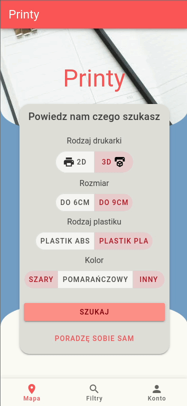

# PrintyAPI

 Api for Printy.

## What is Printy

Printy is a web app, which solves the problem of difficult access to printing spots. Printy allows any private person to share his idle printer and earn some money from it. With Printy, customer can easily find and upload files to print and then just go pick up it from the neighbour. 

## Techstack

* ASP.Net Core 3.1
* C#
* Swagger
* FluentValidation

*Made in 24h on hackthon [`SheepYourHack`](https://sheepyourhack.com/) 2020.*

